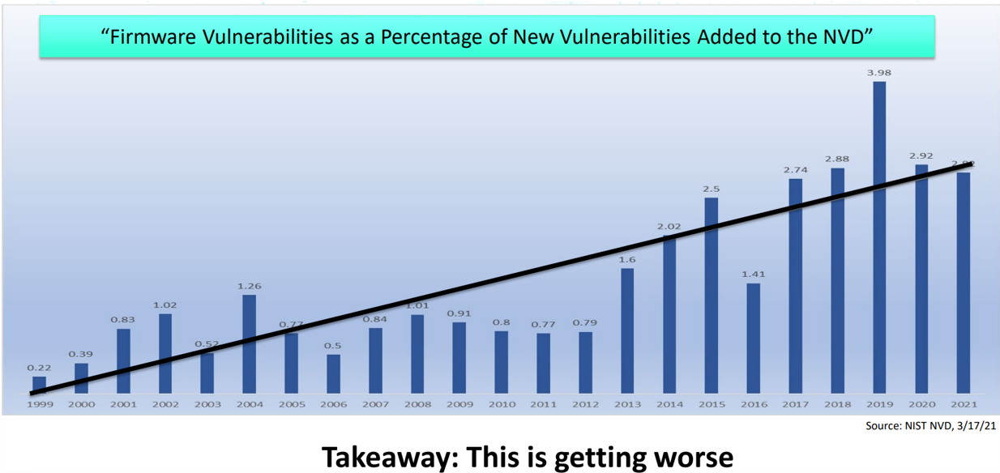

# **Project Mu Memory Protection Updates**


# **Table of Contents**

- [**Project Mu Memory Protection Updates**](#project-mu-memory-protection-updates)
- [**Table of Contents**](#table-of-contents)
- [**Focusing on Memory Protections in UEFI Firmware**](#focusing-on-memory-protections-in-uefi-firmware)
- [**Defining Minimal System Protections**](#defining-minimal-system-protections)
- [**Introducing Dynamic Memory Protection Settings**](#introducing-dynamic-memory-protection-settings)
  - [**Explanation**](#explanation)
    - [**A Note on Memory Protection in PEI**](#a-note-on-memory-protection-in-pei)
  - [**DXE Memory Protection HOB Structure**](#dxe-memory-protection-hob-structure)
    - [**Memory Protection Version Number**](#memory-protection-version-number)
    - [**Null Pointer Detection**](#null-pointer-detection)
    - [**Image Protection Policy**](#image-protection-policy)
    - [**NX Memory Protection Policy**](#nx-memory-protection-policy)
    - [**Page Guards**](#page-guards)
    - [**Pool Guards**](#pool-guards)
    - [**HeapGuardPolicy**](#heapguardpolicy)
    - [**CPU Stack Guard**](#cpu-stack-guard)
    - [**Stack Cookies**](#stack-cookies)
  - [**Code**](#code)
    - [**Reference Commit**](#reference-commit)
    - [**Creating the Memory Protection HOB**](#creating-the-memory-protection-hob)
    - [**Consuming the Memory Protection HOB**](#consuming-the-memory-protection-hob)
- [**Memory Protection Exception Handling and Exception Persistence**](#memory-protection-exception-handling-and-exception-persistence)
  - [**Explanation**](#explanation-1)
  - [**Code**](#code-1)
    - [**Reference Commits**](#reference-commits)
    - [**Including the Memory Protection Exception Handler**](#including-the-memory-protection-exception-handler)
    - [**Including the Exception Persistence Library**](#including-the-exception-persistence-library)
- [**Memory Protection Initialization in DXE**](#memory-protection-initialization-in-dxe)
  - [**Explanation**](#explanation-2)
    - [**Memory Protection Special Regions**](#memory-protection-special-regions)
  - [**Code**](#code-2)
    - [**Reference Commits**](#reference-commits-1)
    - [**Using Special Memory Regions**](#using-special-memory-regions)
- [**Setting NX on EFI Code Memory Types and NX\_COMPAT**](#setting-nx-on-efi-code-memory-types-and-nx_compat)
  - [**Explanation**](#explanation-3)
  - [**Code**](#code-3)
    - [**Reference Commit**](#reference-commit-1)
- [**Tools and Tests**](#tools-and-tests)
- [**Other Miscellaneous Changes**](#other-miscellaneous-changes)

# **Focusing on Memory Protections in UEFI Firmware**

The Unified Extensible Firmware Interface (UEFI) standard accounts for the firmware design implemented in 80 to 90
percent of the of PCs and servers sold worldwide. Developed and supported by more than 250 industry-leading companies,
UEFI firmware is responsible for booting and securing billions of devices spanning device classes from embedded
applications to multi-role server systems.

The flexibility afforded by the UEFI Specification scales across the PC ecosystem to enable contributions from vendors
at different points in the supply chain to participate in a single chain of trust on the device. Hardware vendors have
carefully constructed immutable launch environments that can securely handoff to UEFI firmware which has the
distinguished responsibility to expand system functionality to the point it can hand off to an operating system.
Needless to say, UEFI firmware plays a crucial role in guiding system intiailization down a consistent and reliable
execution path that underpins the security and integrity of the platform throughout its lifetime.

While considerable attention has been devoted to hardware trust anchors and operating system security, attackers have
discovered that UEFI firmware is lacking basic memory protections that have been present in other system software for
over a decade. Coupled with the inconsistency of security capabilities inherit to vendor firmware implementations,
UEFI firmware has become an increasingly attractive system attack vector. Exploiting a firmware vulnerability can be
especially rewarding for an attacker since it can compromise hypervisor-based technologies such as Virtulization Based
Security (VBS) and be used to establish boot kits that subvert antivirus and malware detection software in the
operating system.

The US Department of Homeland Security (DHS) Cybersecurity and Infrastructure Security Agency (CISA) presented
data at the 2021 RSA Conference that shows a growing percentage of new firmware vulnerabilities to the National
Vulnerability Database (NVD) that is maintained by NIST.



> Source: [DHS CISA Strategy to Fix Vulnerabilities Below the OS Among Worst Offenders](https://static.rainfocus.com/rsac/us21/sess/1602603692582001zuMc/finalwebsite/2021_US21_TECH-W13_01_DHS-CISA-Strategy-to-Fix-Vulnerabilities-Below-the-OS-Among-Worst-Offenders_1620749389851001CH5E.pdf)

Firmware vulnerabilities come in many forms, a common class of vulnerability is exploiting poor memory management by
taking advantage of memory corruption. Below are common forms of mitigation techniques used by system software to
protect against these types of vulnerabilities.


> Source: [DHS CISA Strategy to Fix Vulnerabilities Below the OS Among Worst Offenders](https://static.rainfocus.com/rsac/us21/sess/1602603692582001zuMc/finalwebsite/2021_US21_TECH-W13_01_DHS-CISA-Strategy-to-Fix-Vulnerabilities-Below-the-OS-Among-Worst-Offenders_1620749389851001CH5E.pdf)

Even after employing significant resources to apply many of these techniques in addition to static analysis, fuzzers,
etc., Microsoft reported at the 2019 BlueHat IL conference that [approximately 70%](https://msrc.microsoft.com/blog/2019/07/a-proactive-approach-to-more-secure-code/)
of vulnerabilities Microsofts assigns a Common Vulnerability and Exposure (CVE) record are due to memory safety issues.


> Source: [Trends, challenges, and strategic shifts in the software vulnerability mitigation landscape](https://github.com/microsoft/MSRC-Security-Research/blob/master/presentations/2019_02_BlueHatIL/2019_01%20-%20BlueHatIL%20-%20Trends%2C%20challenge%2C%20and%20shifts%20in%20software%20vulnerability%20mitigation.pdf)

Of course, this is not a new problem. The firmware ecosystem has been aware of the importance of these mitigations for
sometime. For example, non-execute (NX) protection support for System Management Mode (SMM) was presented at the
2015 UEFI Plugfest. Yet in 2023, most SMM drivers are not built as NX compatible.


> Source: [UEFI Firmware - Securing SMM](https://uefi.org/sites/default/files/resources/UEFI_Plugfest_May_2015%20Firmware%20-%20Securing%20SMM.pdf)

In a 2021 Black Hat presentation, the authors highlight awareness of UEFI firmware memory safety shortcomings by the
industry but lack of action to do anything about it.


> Source: [Safeguarding UEFI Ecosystem: Firmware Supply Chain is Hard(coded)](https://i.blackhat.com/USA21/Wednesday-Handouts/us-21-Safeguarding-UEFI-Ecosystem-Firmware-Supply-Chain-Is-Hardcoded.pdf)

Many other recent security conferences and academic papers that can readily be found online have been devoted to
detailing shortcomings in UEFI firmware memory safety.

The call to action is palpable. This document describes how to harness years of collective effort by the UEFI firmware
community into a set of memory protections that can be applied in the [TianoCore EDK II](https://github.com/tianocore/edk2)
to mitigate memory-related attacks in implementations across the supply chain.

# **Defining Minimal System Protections**

Memory protections encompass various technologies and techniques. To help establish a baseline, we recommend all systems
have the following basic protections in place (at least in DXE):

1. Null pointer detection
2. Stack guard (NX stack and a stack guard page)
3. Heap guard
4. Image protection (read-only code sections and NX data sections)

More details for each of these protections is defined below.

| Protection Name         | Definition                                                                                                                              |
|-------------------------|-----------------------------------------------------------------------------------------------------------------------------------------|
| Null Pointer Detection  | - `EFI_MEMORY_RP` applied to the 4K page at the NULL address                                                                            |
| Stack Guard             | - `EFI_MEMORY_RP` applied to the base of the stack to catch overflow - `EFI_MEMORY_XP` applied to the entire stack to prevent execution |
| Heap Guard (Page Guard) | - Allocated pages flanked by pages marked with `EFI_MEMORY_RP`                                                                          |
| Image Protection        | - Data and code sections separated - Data sections have the attribute `EFI_MEMORY_XP` and code sections have `EFI_MEMORY_RO`            |

# **Introducing Dynamic Memory Protection Settings**

## **Explanation**

In the past, memory protection settings were configured via FixedAtBuild PCDs (Platform Configuration Database),
which resulted in a build-time configuration of memory mitigations. This approach limited the flexibility of applying
mitigations to the system and made it difficult to update or adjust the settings post-build.

In a design implemented within Project Mu, the configuration interface has been revised to allow more dynamic
configuration. **This is achieved with Handoff Blocks (HOBs)** that are published prior to invocation of the
`HandoffToDxe()` function. This new approach enables the system to adjust memory protection settings at runtime,
providing greater flexibility and the ability to quickly respond to security threats and adjust strictness according
to compatibility and security goals of a given boot profile.


In addition to transitioning away from the FixedAtBuild PCD system, Project Mu has made several additional
updates to ensure system integrity. The new design takes into account different platform states, providing the
platform with more information to respond to changes in security state, thus ensuring that memory protection settings
are properly configured in each unique scenario. These updates work together to provide a more robust and secure
firmware platform for modern devices.

In Project Mu, memory protection configuration is managed through the use of HOB entries for both Management Mode (MM)
and Driver Execution Environment (DXE) phases separately. The only difference in MM memory protection between EDK2 and
Project Mu is the use of the HOB.

Due to the fact that MM does not apply to all architectures and that there are no substantial changes
to MM memory protections in Project Mu compared to EDK2, it will be mostly skipped in this document. For more
information on the available memory protection settings for MM in Project Mu, see
[MmMemoryProtectionSettings.h](https://github.com/microsoft/mu_basecore/blob/HEAD/MdeModulePkg/Include/Guid/MmMemoryProtectionSettings.h)
in the [Project Mu Mu Basecore GitHub repository](https://github.com/microsoft/mu_basecore).

### **A Note on Memory Protection in PEI**

Project Mu does not use the HOB to configure memory protection settings before DXE. Instead, PEI has a
fixed configuration resulting in the page table always being built, the NULL page being invalidated,
a stack guard being reserved for each processor, each stack being marked non-executable, and stack
switching being initialized in case of stack corruption. It is possible that the PEI configuration
may be updated to be dynamically configurable in the future if future use cases require this functionality.

## **DXE Memory Protection HOB Structure**

### **Memory Protection Version Number**

To account for possible future changes to the memory protection HOB and submodule configurations which cause a desync
between the expected and actual definition of the memory protection HOB, a version number is included in the HOB.
Checking the first byte of the HOB, the version number, allows the system to determine if the HOB is valid and
matches the expected data structure layout.

### **Null Pointer Detection**

Pages are allocated in 4KB chunks. This policy marks the first 4KB page at the NULL address to be not present/not valid.

**Overhead**

O(1) since the system only needs to enable NULL pointer detection once in the system.

**Available Settings**

- UefiNullDetection  - Enable NULL pointer detection for DXE
- DisableEndOfDxe    - Disable NULL pointer detection just after EndOfDxe
- DisableReadyToBoot - Disable NULL pointer detection just after ReadyToBoot

### **Image Protection Policy**

The Image protection policy sets code sections to read-only and data sections to non-executable.

There are 3 environment assumptions for enabling image protection:

1. The PE code section and data sections are not merged. If those 2 sections are merged, a
page fault/translation fault may be generated because the entire image might be set to read only.

2. The PE image can be protected if it is page aligned. This feature should **NOT** be used if there is any
self-modifying code in the code region because code regions will be marked as read-only.

3. Platform configuration must not disable NX technology in the processor. If a platform disables NX,
the page table/translation table will become invalid because the NX bit in the page table entry becomes
a RESERVED bit and a page fault/translation fault will be generated.

**Overhead**

**O(n)** time and space overhead where n is the number of images. Each image requires a 6K attributes header, so
if there are **n** images the space overhead will be 6K\*n and thus O(n) time to populate the headers. In most
cases the number of images is in the order of hundreds making this feature relatively inexpensive.

Because this feature requires aligned images, there will likely be an increased size footprint for each image to add the required padding.

**Available Settings**

- FromUnknown                  - Protect images from unknown devices
- FromFv                       - Protect images from firmware volume
- RaiseErrorIfProtectionFails  - If set, images which fail to be protected will be unloaded. This excludes failure
because CPU Arch Protocol has not yet been installed because protection requires the protocol.
- BlockImagesWithoutNxFlag     - NX may be set on EfiLoaderCode, EfiBootServicesCode, and EfiRuntimeServicesCode
if the setting for each is active in the NX Memory Protection Policy. However, if an image is loaded which does not indicate support for
NX via the NX_COMPAT DLL flag in the header, the logic will cease to set the non-executable attribute on allocations of memory of
type EfiLoaderCode, EfiBootServicesCode, and/or EfiRuntimeServicesCode. Using the BlockImagesWithoutNxFlag setting
in this policy will prevent images which don't support NX_COMPAT from loading and thus cause NX to continue to be applied
to allocations of a code memory type based on their respective setting in the NX Memory Protection Policy.
For more info, see the section "Setting NX on EFI Code Memory Types and NX_COMPAT"

### **NX Memory Protection Policy**

This policy sets the NX attribute to memory of the associated memory type.

Every active memory type will be mapped as non-executable once the CPU Architectural Protocol is available.

**Overhead**

**O(n)** time where n is the number of memory mapped regions. The number of actual set bits beyond one is
inconsequential because every memory region must be checked if at least one bit is set.

**Available Settings**

The available settings are all EFI memory types. The only settings of note are EfiLoaderCode, EfiBootServicesCode, and
EfiRuntimeServicesCode. If an image does not indicate support for NX via the NX_COMPAT DLL flag, the logic will
cease to set the NX attribute on allocations of memory this type. Using the BlockImagesWithoutNxFlag in the Image
Protection Policy will prevent images which don't support NX_COMPAT.

### **Page Guards**

The HeapGuardPageType policy implements guard pages on the specified memory types to detect heap overflow. If a bit
is set, a guard page will be added before and after the corresponding type of page allocated if there's enough free
pages for all of them. Guard pages are set to not present/not valid so any attempt to access them will cause a page
fault/translation fault. The system will do its best to ensure that only one guard page separates two allocated
pages to avoid wasted space.

**Overhead**

**O(n)** time where n is the number of page allocations/frees. Because there are 2 extra pages allocated for
every call to AllocatePages(), **O(n)** space is also required.

**Available Settings**

The available settings are all EFI memory types.

### **Pool Guards**

The HeapGuardPoolType policy is essentially the same as HeapGuardPageType policy. For each active memory type,
a guard page will be added just before and after the portion of memory which the allocated pool occupies.
The only added complexity comes when the allocated pool is not a multiple of the size of a page.
In this case, the pool must align with either the head or tail guard page, meaning either overflow or underflow
can be caught consistently but not both. The head/tail alignment is set in HeapGuardPolicy via the Direction setting.

**Overhead**

Same as above: **O(n)** time and space for same reasons as HeapGuardPageType. This functionality requires creating
guard pages, meaning that for n allocations, 4k \* (n + 1) (assuming each of the n pools is adjacent to another pool)
additional space is required.

**Available Settings**

The available settings are a bit for each Efi Memory Type. Setting the bit enables Pool Guards for the specific
memory allocation of that type.

### **HeapGuardPolicy**

While the above two policies (Pool Guards and Page Guards act as a switch for each protectable memory type,
this policy is an enable/disable switch for those two policies (ex. if UefiPageGuard is unset, page guards
in DXE are inactive regardless of the Page Guard settings).

The only aspect of this policy which should be elaborated upon is Direction. Direction dictates whether
an allocated pool which does not fit perfectly into a multiple of pages is aligned to the head or tail guard.

On free the pool head/tail is checked to ensure it was not overwritten while the not present/not valid page will
trigger a page fault/translation fault immediately.

**Overhead**

**O(n)** time where n is the number of pool allocations/frees. Because there are 2 extra pages allocated for
every call to AllocatePool(), **O(n)** space is also required.

**Available Settings**

- UefiPageGuard - Enable UEFI page guard
- UefiPoolGuard - Enable UEFI pool guard
- UefiFreedMemoryGuard - Enable Use-After-Free memory detection
- Direction - Specifies the direction of Guard Page for pool guards. If 0, the returned
pool is near the tail guard page. If 1, the returned pool is near the head guard page. The
default value for this is 0

### **CPU Stack Guard**

The CpuStackGuard policy indicates if UEFI Stack Guard will be enabled.

The stack guards add two additional pages to the bottom of the stack(s). The first page is simply the guard page
which is set to not present/not valid. When a page fault occurs, the current stack address is invalid and so it is not
possible to push the error code and architecture status onto the current stack. Because of this, there is a
special "Exception Stack" or "Known Good Stack" which is the second page placed at the bottom of the stack.
This page is reserved for use by the exception handler and ensures that a valid stack is always present when an
exception occurs for error reporting.

**Note**

In Project Mu, CpuStackGuard is hard-coded to be TRUE in PEI phase, so we always set up a switch
stack, clear the present/valid bit in the page table for the guard page of the Boot Strap Processor
stack, and build the page tables. However, the stack switch handlers will still only be
installed in DXE phase if CpuStackGuard is TRUE.

**Overhead**

**O(1)** time and space.

**Available Setting**

- If TRUE, UEFI Stack Guard will be enabled.

### **Stack Cookies**

Stack Cookies enable protection of the stack return pointer. The stack cookie value is specific
to each loaded image and is generated at random on image load. Stack cookies are enabled at compile time, but if this
setting is FALSE the interrupts generated by stack cookie check failures will be ignored my Prjoect Mu's
page fault handler.

**Overhead**

A stack cookie is added to each stack frame and checked at the end of each function. The overhead is O(n) where n is
the number of function calls.

**Available Setting**

- If TRUE, stack cookie failures will cause a warm reset. If FALSE, stack cookie failure interrupts will be ignored.

## **Code**

### **Reference Commit**

You can find the set of changes to enable the use of the Memory Protection HOB in
[this commit](https://github.com/microsoft/mu_basecore/commit/836904040f426fb16befdafd936fbd35cdbb8523).

### **Creating the Memory Protection HOB**

Somewhere within the PEI code, follow the pattern:

```C
  #include <Guid/DxeMemoryProtectionSettings.h>

  DXE_MEMORY_PROTECTION_SETTINGS  DxeSettings;

  DxeSettings = (DXE_MEMORY_PROTECTION_SETTINGS)DXE_MEMORY_PROTECTION_SETTINGS_DEBUG;

  BuildGuidDataHob (
    &gDxeMemoryProtectionSettingsGuid,
    &DxeSettings,
    sizeof (DxeSettings)
    );
```

This will also require you to add gMemoryProtectionSettingsGuid under the Guids section in the relevant INF.

If you want to deviate from one of the settings profile definitions, it is recommended
that you start with the one which most closely aligns with your desired settings and update from there in a
manner similar to below:

```C
  MmSettings.HeapGuardPolicy.Fields.MmPageGuard                    = 0;
  MmSettings.HeapGuardPolicy.Fields.MmPoolGuard                    = 0;
  DxeSettings.ImageProtectionPolicy.Fields.ProtectImageFromUnknown = 1;
```

before building the HOB.

### **Consuming the Memory Protection HOB**

For DXE settings, add the following to the platform DSC file:

```C
[LibraryClasses.Common.DXE_DRIVER, LibraryClasses.Common.DXE_CORE, LibraryClasses.Common.UEFI_APPLICATION]
  DxeMemoryProtectionHobLib|MdeModulePkg/Library/MemoryProtectionHobLib/DxeMemoryProtectionHobLib.inf
```

and the following to each .c or .h file which needs to use the memory protection settings:

```C
#include <Library/DxeMemoryProtectionHobLib.h>
```

Once library constructors have executed, the global gDxeMps will be populated with the settings from the HOB.
So, for example, to check if page guards are enabled, you can use:

```C
if (gDxeMps.HeapGuardPolicy.Fields.UefiPageGuard) {
  // Page guards are enabled
}
```

**Protection Policy Integrity Checking**

The settings version will be checked within the library constructor and if there is a mismatch, an ASSERT
will be generated. When the Memory Protection HOB is consumed, the settings are copied into a global variable.
Prior to copying, the settings are validated to ensure they are compatible with each other. If a subset of settings
are incompatible, all will be turned off and a warning will be printed via a DEBUG call.

# **Memory Protection Exception Handling and Exception Persistence**

## **Explanation**

The memory protection exception handler is responsible for handling all exceptions resulting from a page fault/translation fault
when memory protection are active. When a page fault/translation fault occurs, the exception handler will log the instruction
pointer via the Project Mu Report Status Code logic which attempts to create a hardware error record in the platform
early-store. The exception handler will also log the exception type which caused the exception via the ExceptionPersistenceLib
which currently only has a CMOS backed implementation.

## **Code**

### **Reference Commits**

You can find the MdeModulePkg base implementation of ExceptionPersistenceLib in
[this commit](https://github.com/microsoft/mu_basecore/commit/19d80a510e42706d60558bb649584262295a6de6).

The ExceptionPersistenceLib CMOS implementation can be found
[here](https://github.com/microsoft/mu_plus/blob/HEAD/MsCorePkg/Library/ExceptionPersistenceLibCmos/ExceptionPersistenceLibCmos.c).

The implementation of the Memory Protection Exception Handler can be found
[here](https://github.com/microsoft/mu_plus/blob/HEAD/MsCorePkg/Library/MemoryProtectionExceptionHandlerLib/MemoryProtectionExceptionHandlerLib.c)
.

### **Including the Memory Protection Exception Handler**

The exception handler is a library linked to CpuDxe to ensure it is installed as early as possible. The following is how to
link the library to CpuDxe via the platform DSC file:

```C
UefiCpuPkg/CpuDxe/CpuDxe.inf {
    <LibraryClasses>
    NULL|MsCorePkg/Library/MemoryProtectionExceptionHandlerLib/MemoryProtectionExceptionHandlerLib.inf
  }
```

### **Including the Exception Persistence Library**

For platforms with CMOS, the following declaration should be used in the platform DSC file:

```C
[LibraryClasses]
  ExceptionPersistenceLib|MsCorePkg/Library/ExceptionPersistenceLibCmos/ExceptionPersistenceLibCmos.inf
```

Exceptions can be fetched via the ExceptionPersistenceLib API as follows:

```C
#include <Library/ExceptionPersistenceLib>

EXCEPTION_TYPE  Exception;

if (!EFI_ERROR (ExPersistGetException (&Exception))) {
  // Exception enum is valid. Check the value to determine if an exception occurred.
}
```

# **Memory Protection Initialization in DXE**

## **Explanation**

Currently, the CPU Architectural Protocol is required to set memory attributes. This limitation means careful accounting is required
to ensure protection is maximized without breaking execution when attributes are applied in DXE.
In Project Mu, the InitializePageAttributesForMemoryProtectionPolicy()
function is called after the CPU Protocol is installed and the applies the memory protection policy to all of memory. The logic builds
a complete memory map and determines the access attributes of each region based on memory type, protected and unprotected loaded image
addresses, and any regions identified as requiring particular attributes via the "Special Memory Protection Region" reporting system.

The time between DXE driver dispatch and CPU Architecture Protocol installation leaves a gap. Minimizing this gap is a
future work item.


### **Memory Protection Special Regions**

To provide extra flexibility for platforms which need certain memory regions to have page attributes which deviate from the overall memory
protection policy, the platform can specify "Special Memory Protection Regions" which will override the memory protection policy.

Memory protection is not activated until the CPU Architecture Protocol has been installed. This restriction is because the
CPU Arch Protocol protocol provides access to the interface for updating memory attributes.
Many allocations and image loads will have occurred by the time the protocol is published so careful accounting
is required to ensure appropriate attributes are applied. An event notification triggered on the CPU Architecture
Protocol installation will combine the GCD and EFI memory maps to create a full map of memory for use internally
by the memory protection initialization logic. Because image memory is allocated for the entire image and not each
section (code and data), the images are separated within the combined map so no-execute can be applied to data
regions and read-only can be applied to code regions. After breaking up the map so each DXE image section has
its own descriptor, every non-image descriptor will have its attributes set based on its EFI memory type. There are
cases where the platform will want to apply attributes to a region of memory which is different than what would be
applied based on its EFI memory type. In this case, platforms can utilize the Memory Protection Special Region
interface to specify regions which should have specific attributes applied during memory protection initialization.

## **Code**

### **Reference Commits**

You can find the base implementation of InitializePageAttributesForMemoryProtectionPolicy() in
[this commit](https://github.com/microsoft/mu_basecore/commit/edd8875289659e323d240fd429c5ce8a5cc4fa5d).

You can find the implementation of Special Memory Protection Regions along with the extra logic to handle those regions during
memory protection initialization in
[this commit](https://github.com/microsoft/mu_basecore/commit/f1c5c8a42f4b9f4f7c6d4c5a77e83cc8c958bb30).

### **Using Special Memory Regions**

Example Declaration of a Special Region in PEI:

```C
#include <Guid/MemoryProtectionSpecialRegionGuid.h>

MEMORY_PROTECTION_SPECIAL_REGION SpecialRegion;
SpecialRegion.Start       = 0x1000;
SpecialRegion.Length      = 0x1000;
SpecialRegion.Attributes  = EFI_MEMORY_RO;

BuildGuidDataHob (
    &gMemoryProtectionSpecialRegionHobGuid,
    &SpecialRegion,
    sizeof (SpecialRegion)
    );

```

Example Declaration of a Special Region in DXE:

```C
#include <Protocol/MemoryProtectionSpecialRegionProtocol.h>

MEMORY_PROTECTION_SPECIAL_REGION_PROTOCOL *SpecialRegionProtocol = NULL;
EFI_PHYSICAL_ADDRESS  BufferStart       = 0x1000;
UINT64                BufferLength      = 0x1000;
UINT64                BufferAttributes  = EFI_MEMORY_RO;

Status = gBS->LocateProtocol (&gMemoryProtectionSpecialRegionProtocolGuid, NULL, (VOID **)&SpecialRegionProtocol);
ASSERT_EFI_ERROR (Status);
if (SpecialRegionProtocol != NULL) {
  Status = SpecialRegionProtocol->AddSpecialRegion (
                                    BufferStart,
                                    BufferLength,
                                    BufferAttributes
                                    );

  ASSERT_EFI_ERROR (Status);
}
```

These special regions also may be used during paging audit tests which check if the page table has secure
attributes. For example, an existing test checks to see if there are any Read/Write/Execute memory regions and fail
if true. During this test, if a Read/Write/Execute region is found, it will be checked against the special regions
and a test failure will not be emitted if the page attributes are consistent with the attributes identified in
the overlapping special region.

# **Setting NX on EFI Code Memory Types and NX_COMPAT**

## **Explanation**

Because of the extra accounting performed during the initialization of memory protection, EFI types EfiLoaderCode,
EfiBootServicesCode, and EfiRuntimeServicesCode can have the NX attribute set in the memory protection policy.
If these regions are part of an image, the initialization logic will apply read-only and no-execute attributes
based on the section type of the images. If these regions are not part of an image and were allocated in
a DXE component loaded before CpuDxe, a memory protection special region will be created to ensure that the
correct attributes are applied to the buffer. For many platforms, there will be allocations from PEI which will
have NX applied based on this policy. Applying no-execute to these regions should not be an issue unless the platform
needs to jump back into 32-bit mode and execute those regions (eg: Intel platforms using API Mode FSP). However,
such platforms can also create memory protection special regions to exempt the relevant PEI buffers from the memory
protection policy.

In Project Mu, all DXE components should be built with the NX_COMPAT PE/COFF linker option. As long as every image
loaded has the NX_COMPAT flag, the NX policy setting for EfiLoaderCode, EfiBootServicesCode, and EfiRuntimeServicesCode
will be respected. However, if a an image is loaded without the NX_COMPAT flag, the NX policy setting will be ignored
and all allocation of EFI type EfiLoaderCode, EfiBootServicesCode, and EfiRuntimeServicesCode will not have NX applied.

## **Tools and Tests**

Several tools are provided to assist in auditing and debugging memory protections.

### **Memory Protection Test App**

Purpose: Tests page guards, pool guards, stack guard, NX protection, NULL detection.

- Can be run by violating expected protections and either clearing the fault or performing a reset.
- Can be run by checking allocated buffers using the Memory Attribute Protocol.

[Link](https://github.com/microsoft/mu_plus/tree/HEAD/UefiTestingPkg/FunctionalSystemTests/MemoryProtectionTest)

### **Memory Attribute Protocol Test App**

Purpose: Verifies Memory Attribute Protocol functionality.

[Link](https://github.com/microsoft/mu_plus/tree/HEAD/UefiTestingPkg/FunctionalSystemTests/MemoryAttributeProtocolFuncTestApp)

### **PE COFF Image Validation**

Purpose: Tests PE images against a set of tests and associated requirements.

- Can be used to verify NX_COMPAT is set, sections are W^X, sections are aligned, etc.

[Link](https://github.com/microsoft/mu_basecore/tree/HEAD/.pytool/Plugin/ImageValidation)

## **Code**

### **Reference Commit**

You can find the implementation of NX on EFI Code Memory Types and NX_COMPAT in
[this commit](https://github.com/microsoft/mu_basecore/commit/0712afe04e2013dc2e04172885a21bd6c53e26d7).

# **Other Miscellaneous Changes**

The following are some miscellaneous changes to the memory protection policy in Project Mu.

1. PciHostBridgeDxe will
[apply no-execute protection to MMIO space](https://github.com/microsoft/mu_basecore/blob/5bfa23b2f6436795cce1459e90c481485f006b94/MdeModulePkg/Bus/Pci/PciHostBridgeDxe/PciHostBridge.c#L539)
based on the NX Protection Policy.

2. The Project Mu tools_def changes will
[build with the /GS flag](https://github.com/microsoft/mu_basecore/commit/e1b1a480f35ebf632f6dae9aef9276b43f21afe4)
to enable stack cookies for Visual Studio builds.
Stack cookies are a security feature that helps to detect and prevent buffer overflow attacks by placing a random value on the stack.
However, if the StackCookie protection policy boolean is FALSE, stack cookie violations
[will be ignored when MemoryProtectionExceptionHandlerLib is used](https://github.com/microsoft/mu_plus/blob/68dd8ed30020792cdccbf53b97389be7f19d7478/MsCorePkg/Library/MemoryProtectionExceptionHandlerLib/MemoryProtectionExceptionHandlerLib.c#L125)
.

3. The CoreInternalFreePages() routine in Page.c has been updated to
[clear the page attributes of the region being freed](https://github.com/microsoft/mu_basecore/blob/5bfa23b2f6436795cce1459e90c481485f006b94/MdeModulePkg/Core/Dxe/Mem/Page.c#L1570)
if the applied attributes would cause a fault when attempting to free the pages.
